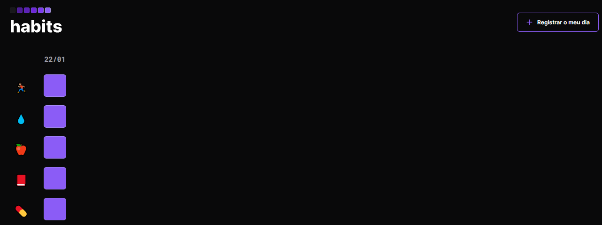

# NLW-SETUP 

Exercise from the explorer track at the NLW-SETUP event, organized by Rocketseat.

🔗 [Click here to access](https://carvmi.github.io/nlw-setup/)

## Technologies 
- HTML
- CSS
- Git and Github
- Figma

## What I have learned
### HTML and CSS
- The class selector is repeatable and has a lower specificity than id;
- Html and svg are "children" of xml;
- The purpose of svg is to create images from text;
- Putting the svg code on a page called "assets" and replacing the svg with an img element makes the html more organized;
- Remove margin and padding in the universal selector, as well as leaving box-sizing as border-box;
- Customize the button element and give it a transparent background by using the background-color property as transparent;
- The space between two elements is called "gap", when the display is flex;
- The border-radius property works on an input defined as checkbox when the appearance and -webkit-appearance properties are set to "none";
- Use the "input:checked" pseudo-selector to change the appearance of the button when it is checked;
- The habit emojis and the days are in a generic box called "form";

### JAVASCRIPT
- To include JavaScript in the html file you need to add, before closing the "body", the element "script";
- Values or contents are assigned to variables, such as "const" and "if";
- The information can be presented as text, numbers, booleans (logical values: true or false) or more structured data (functions, objects);
- Some existing functionalities are "querySelector", "setData", "load", "addEventListener", "alert", "parse";
- Events like "addEventListener" trigger some function like "add" or "save;
- Slice functionality works on string objects;
- Use "JSON.stringfy ( )" to transform an object into text;
- Use "JSON.parse ( )" To transform a text into an object;
- Use the function toLocaleDateString('en-us') to transform a date from en-en (English) to en-us (Brazilian Portuguese);
- If the day already exists, it triggers an alert informing that it already exists. If not, another alert informs that it was added successfully;
- If you try to access the habits through another browser, a new localStorage will be formed;

## Contact
milenadecarvalho2000@gmail.com
